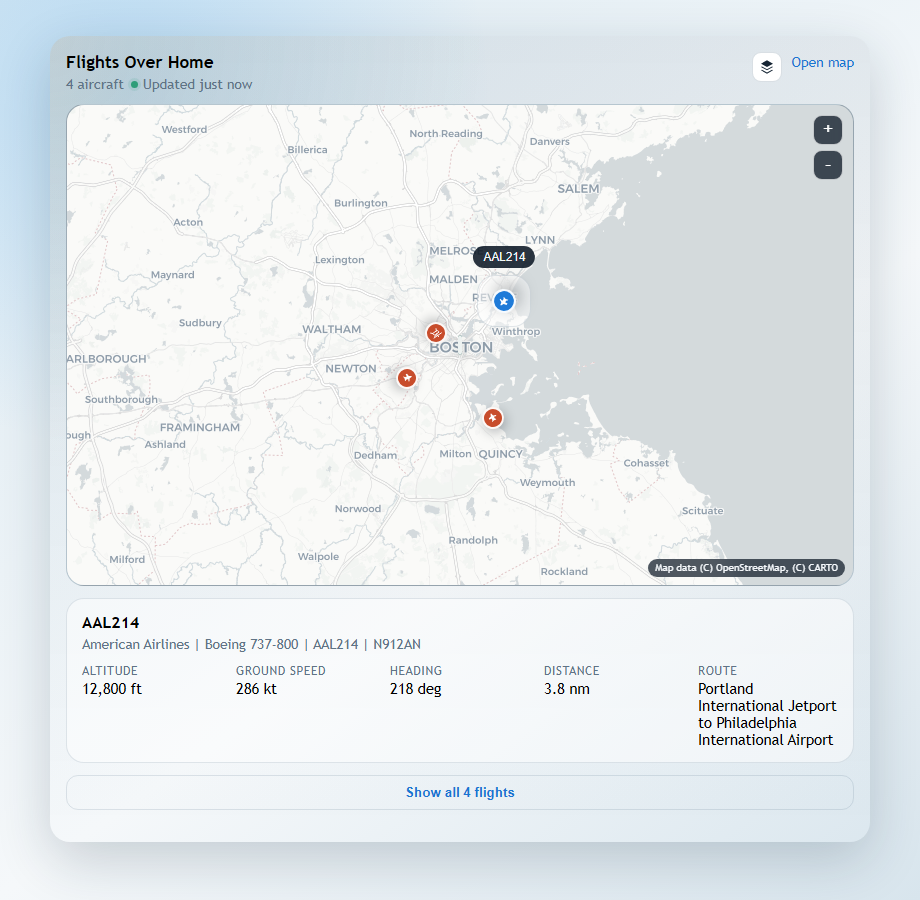

# HA Nearby Flights Card

[](https://github.com/Farleykri/ha-nearby-flights/actions/workflows/validate.yaml)
[](LICENSE)

`ha-nearby-flights` is a HACS dashboard/plugin repository for a Lovelace card that works with the existing [home-assistant-flightradar24](https://github.com/AlexandrErohin/home-assistant-flightradar24) integration.

It reads the `flights` attribute from `sensor.flightradar24_current_in_area` and plots nearby aircraft on an interactive map with compact selected-flight details.



## What it needs

- Home Assistant
- HACS
- the [home-assistant-flightradar24](https://github.com/AlexandrErohin/home-assistant-flightradar24) integration
- an entity like `sensor.flightradar24_current_in_area` with a `flights` attribute

The card is designed around flight data like:

- `flight_number`
- `callsign`
- `aircraft_registration`
- `latitude`
- `longitude`
- `altitude`
- `ground_speed`
- `airline_name`
- `aircraft_model`
- `airport_origin_name`
- `airport_destination_name`

## Installation

1. Open HACS in Home Assistant and select `Dashboard`.
2. Search for `HA Nearby Flights Card` and download it.
3. If it is not yet available in the default catalog, add `https://github.com/Farleykri/ha-nearby-flights` as a custom `Dashboard` repository first.
4. If HACS does not register the resource automatically, add `/hacsfiles/ha-nearby-flights/ha-nearby-flights.js` as a `JavaScript Module` under dashboard resources.

## Example card

```yaml
type: custom:ha-nearby-flights-card
entity: sensor.flightradar24_current_in_area
title: Flights Over Home
height: 460
zoom: 10
show_home: true
show_list: true
map_theme: auto
interactive_map: true
details_expanded: false
details_timeout: 15
stale_after_minutes: 5
```

The card also includes a visual editor, so these settings can be changed from the Home Assistant dashboard editor without writing YAML.

## Card options

- `entity`: Flightradar24 area sensor, defaults to `sensor.flightradar24_current_in_area`
- `title`: card title
- `height`: map height in pixels
- `zoom`: initial slippy-map zoom level, from `2` to `16`
- `latitude`: optional map center latitude override
- `longitude`: optional map center longitude override
- `max_flights`: maximum number of aircraft markers to render
- `focus_id`: optional initial flight identifier to select
- `map_theme`: built-in map style preset: `auto`, `light`, `dark`, or `satellite`; `auto` follows Home Assistant's light/dark mode
- `show_theme_toggle`: show the compact map-style menu in the card header
- `interactive_map`: enable drag panning, wheel/pinch zoom, and the `+`/`-` controls
- `stale_after_minutes`: age in minutes before the update indicator is marked stale
- `show_center_label`: show the "centered on..." footer label
- `compact_footer`: use the smaller low-profile footer style
- `show_home`: show a home marker using the Home Assistant location when available
- `show_list`: show selected-flight details below the map
- `details_expanded`: show the full selectable aircraft list initially; otherwise it remains behind a compact expand button
- `details_timeout`: seconds to show details after selecting an aircraft; use `0` to keep details visible at all times
- `follow_selected`: center the map on the selected aircraft instead of the home area
- `tile_url`: optional custom tile URL template; when omitted, `map_theme` selects the built-in tile source
- `tile_attribution`: attribution text shown on the map
- `open_url`: optional external map URL template. Supported placeholders are `{lat}`, `{lon}`, `{zoom}`, `{flight_number}`, `{callsign}`, and `{registration}`

## Notes

- `auto` follows Home Assistant's current light or dark mode. `satellite` remains a manual choice in the compact layer menu.
- The map supports mouse or touch dragging, mouse-wheel or pinch zoom, and compact `+`/`-` controls.
- The header shows when flight data was last updated and marks it stale after the configured threshold.
- Selected-flight details stay compact by default, with the full list available through the expand button.
- With a positive `details_timeout`, the details area stays hidden until an aircraft is selected and automatically disappears when the timer expires.
- Built-in `light` and `dark` use CARTO raster tiles, and `satellite` uses Esri World Imagery, so keep the visible attribution in place.
- The "centered on..." footer label is hidden by default now, and the attribution chip uses a smaller compact footer style by default.
- If you set `tile_url`, it takes priority over `map_theme` and the theme toggle is hidden.
- If you prefer a different tile source, override `tile_url` and `tile_attribution`.
- The card only reads Lovelace-visible Home Assistant state. It does not create entities and does not require a companion custom integration.
- Flights without valid latitude and longitude are skipped on the map but still count toward the source sensor's total.
